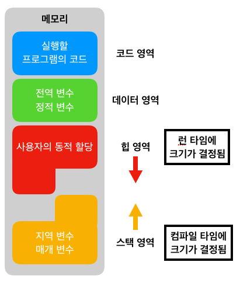

# 메모리 구조

## 1. 코드(code) 영역

메모리의 코드(code) 영역은 실행할 프로그램의 코드가 저장되는 영역으로 텍스트(code) 영역이라고도 부릅니다.

CPU는 코드 영역에 저장된 명령어를 하나씩 가져가서 처리하게 됩니다.

## 2. 데이터(data) 영역

메모리의 데이터(data) 영역은 프로그램의 전역 변수와 정적(static) 변수가 저장되는 영역입니다.

데이터 영역은 프로그램의 시작과 함께 할당되며, 프로그램이 종료되면 소멸합니다.

## 3. 스택(stack) 영역

메모리의 스택(stack) 영역은 함수의 호출과 관계되는 지역 변수와 매개변수가 저장되는 영역입니다.

스택 영역은 함수의 호출과 함께 할당되며, 함수의 호출이 완료되면 소멸합니다.

이렇게 스택 영역에 저장되는 함수의 호출 정보를 스택 프레임(stack frame)이라고 합니다.

스택 영역은 메모리의 높은 주소에서 낮은 주소의 방향으로 할당됩니다.

## 4. 힙(heap) 영역

메모리의 힙(heap) 영역은 사용자가 직접 관리할 수 있는 `그리고 해야만 하는` 메모리 영역입니다.

힙 영역은 사용자에 의해 메모리 공간이 동적으로 할당되고 해제됩니다.

힙 영역은 메모리의 낮은 주소에서 높은 주소의 방향으로 할당됩니다.

 

메모리의 동적 할당에 대한 더 자세한 사항은 C언어 메모리의 동적 할당 수업에서 확인할 수 있습니다.

# 메모리
메인 메모리(main memory)

>메인 메모리는 CPU가 직접 접근할 수 있는 기억 장치   
>프로세스가 실행되려면 프로그램이 메모리에 올라와야 함

주소가 할당된 일련의 바이트들로 구성되어 있음

CPU는 레지스터가 지시하는대로 메모리에 접근하여 다음에 수행할 명령어를 가져옴

명령어 수행 시 메모리에 필요한 데이터가 없으면 해당 데이터를 우선 가져와야 함

이 역할을 하는 것이 바로 MMU.